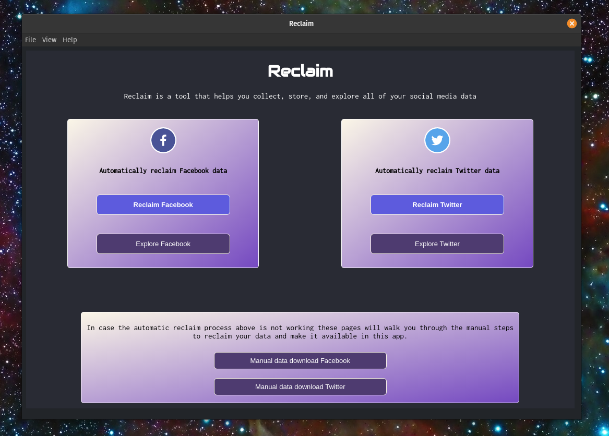
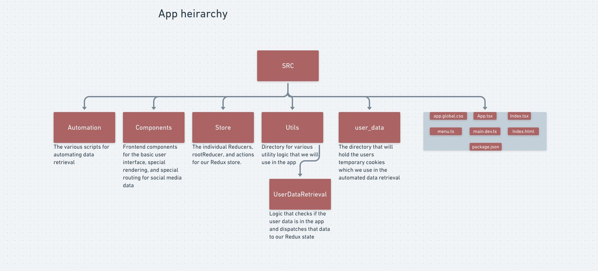

# Reclaim [ALPHA] :construction:
A hub for your personal data

Reclaim is an open source desktop app for collecting and storing your online information. With Reclaim you can collect your social media data in a few clicks and explore every photo, friend, and interaction from your digital life.

We just recently reached our MVP in development and are working hard to get our first full featured release out to the public!

[DEMO](https://www.youtube.com/watch?v=FjeUIIvfBPI)

## Install

Download the latest release from the [release page](https://github.com/ReclaimApp/Reclaim/releases).

## Platform Support
- [x] Windows
- [x] Linux
- [ ] macOS (coming soon)

## Features

- Reclaim Facebook data in one click using our automated scripts
- Manual walkthrough for reclaiming Twitter data
- Explore all of your Facebook data
- Explore all of your Twitter data
- Reclaimed data is saved to your local Documents directory
- Get your data back so you can be free to delete Facebook or Twitter
- Discover the hidden information collected on you that is ONLY available through your reclaimed data
- (Coming soon) Reclaim Twitter data in one click using our automated scripts

## Demo

https://www.youtube.com/watch?v=FjeUIIvfBP

## Join our email list to get early access to features and updates as we expand Reclaim

https://reclaim.social/

## Contact

:bird: [Twitter: @ASeries_ofTubes](https://twitter.com/ASeries_ofTubes)

:email: austin@reclaim.social

## Contribute
We are still very early in the construction of this codebase but would really appreciate any feedback or contribution.

Below is the current app architecture

